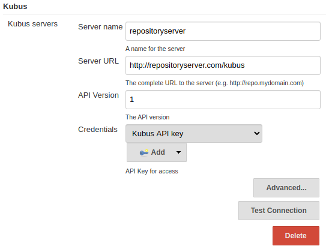
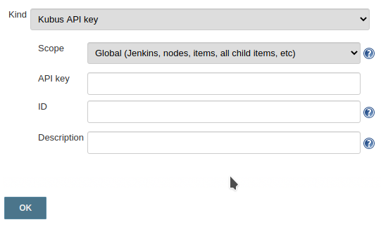
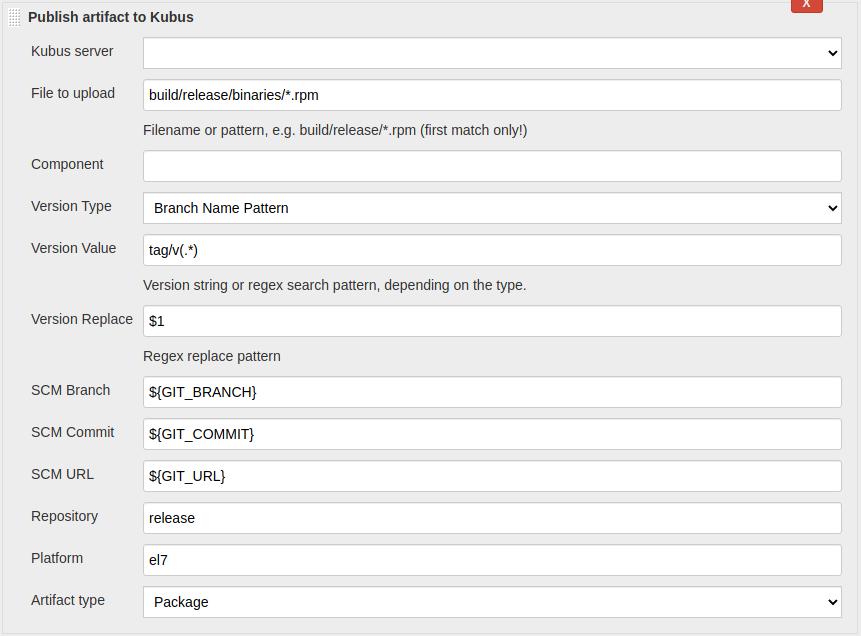

# kubus-jenkins-plugin

Jenkins Publisher

# Usage
Once installed you can configure your Kubus instances in the __Configure System__ settings:

The required API-Key can be configured under __Credentials__:

To upload artifacts to Kubus, add the __Publish artifact to Kubus__ step to your job:

